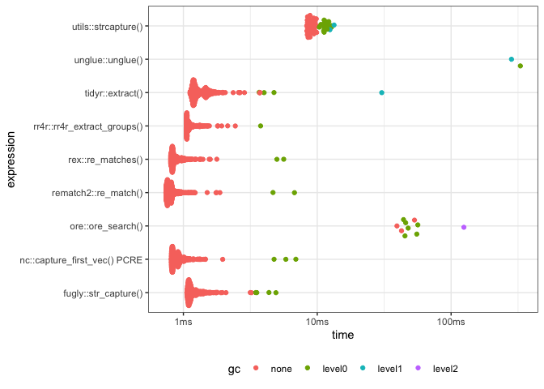

<!-- README.md is generated from README.Rmd. Please edit that file -->

# fugly 

<!-- badges: start -->


<!-- badges: end -->

This package provides a single function (`str_capture`) for using named
capture groups to extract values from strings. A key requirement for
readability is that the names of the capture groups are specified inline
as part of the regex, and not in an external vector or as separate
names.

`fugly::str_capture()` is implemented as a wrapper around
[stringr](https://cran.r-project.org/package=stringr). This is because
`stringr` itself does not yet do named capture groups (See issues for
[stringr](https://github.com/tidyverse/stringr/issues/71) and
[stringi](https://github.com/gagolews/stringi/issues/153)).

`fugly::str_capture()` is very similar to a number of existing packages.
See table below for a comparison.

| Method                      | Speed    | Inline capture group naming | robust |
|-----------------------------|----------|-----------------------------|--------|
| `fugly::str_capture`        | Fast     | Yes                         | No     |
| `rr4r::rr4r_extract_groups` | Fast     | Yes                         | Yes    |
| `nc::capture_first_vec`     | Fast     | No                          | Yes    |
| `tidy::extract`             | Fast     | No                          | Yes    |
| `utils::strcapture`         | Middling | No                          | Yes    |
| `unglue::unglue`            | Slow     | Yes                         | Yes    |
| `ore::ore_search`           | Slow     | Yes                         | Yes    |

### What do I mean when I say `fugly::str_capture()` is unsafe/dodgy/non-robust?

-   It doesn’t adhere to standard regular expression syntax for named
    capture groups as used in perl, python etc.

-   It doesn’t really adhere to `glue` syntax (although it looks similar
    at a surface level).

-   If you specify delimiters which appear in your string input, then
    you’re going to have a bad time.

-   It’s generally only been tested on data which is:

    -   highly structured
    -   only ASCII
    -   non-pathological

### What’s in the box?

-   `fugly::str_capture(string, pattern, delim)`

    -   capture named groups with regular expressions
    -   returns a data.frame with all columns containing character
        strings
    -   can mix-and-match with non-capturing regular expressions
    -   if no regular expression specified for a named group then `.*?`
        is used.
    -   does not do any type guessing/conversion.

## Installation

You can install from [GitHub](https://github.com/coolbutuseless/fugly)
with:

``` r
# install.package('remotes')
remotes::install_github('coolbutuseless/fugly')
```

## Example 1

In the following example:

-   Input consists of multiple strings
-   capture groups are delimited by `{}` by default.
-   the regex for the capture group for `name` is unspecified, so `.*?`
    will be used
-   the regex for the capture group for `age` is `\d+` i.e. match must
    consist of 1-or-more digits

``` r
library(fugly)

string <- c(
  "information: Name:greg Age:27 ",
  "information: Name:mary Age:34 "
)

str_capture(string, pattern = "Name:{name} Age:{age=\\d+}")
```

    #>   name age
    #> 1 greg  27
    #> 2 mary  34

## Example 2

A more complicated example:

-   Note the mixture of capturing groups and a bare `.*?` in the pattern
    which is not returned as a result

``` r
string <- c(
'{"type":"Feature","properties":{"hash":"1348778913c0224a","number":"27","street":"BANAMBILA STREET","unit":"","city":"ARANDA","district":"","region":"ACT","postcode":"2614","id":"GAACT714851647"},"geometry":{"type":"Point","coordinates":[149.0826143,-35.2545558]}}',
'{"type":"Feature","properties":{"hash":"dc776871c868bc7e","number":"139","street":"BOUVERIE STREET","unit":"UNIT 711","city":"CARLTON","district":"","region":"VIC","postcode":"3053","id":"GAVIC423944917"},"geometry":{"type":"Point","coordinates":[144.9617149,-37.8032551]}}',
'{"type":"Feature","properties":{"hash":"8197f34a40ccad47","number":"6","street":"MOGRIDGE STREET","unit":"","city":"WARWICK","district":"","region":"QLD","postcode":"4370","id":"GAQLD155949502"},"geometry":{"type":"Point","coordinates":[152.0230999,-28.2230133]}}',
'{"type":"Feature","properties":{"hash":"18edc96308fc1a8e","number":"22","street":"ORR STREET","unit":"UNIT 507","city":"CARLTON","district":"","region":"VIC","postcode":"3053","id":"GAVIC424282716"},"geometry":{"type":"Point","coordinates":[144.9653484,-37.8063371]}}'
)


str_capture(string, pattern = '"number":"{number}","street":"{street}".*?"coordinates":\\[{coords}\\]')
```

    #>   number           street                  coords
    #> 1     27 BANAMBILA STREET 149.0826143,-35.2545558
    #> 2    139  BOUVERIE STREET 144.9617149,-37.8032551
    #> 3      6  MOGRIDGE STREET 152.0230999,-28.2230133
    #> 4     22       ORR STREET 144.9653484,-37.8063371

## Simple Benchmark

I acknowledge that this isn’t the greatest benchmark, but it is relevant
to my current use-case.

-   [nc](https://github.com/tdhock/nc) with the PCRE regex engine is the
    fastest named capture I could find in R.

    -   However - I’m not a huge fan of its syntax

-   For large inputs (1000+ input strings), `fugly` is significantly
    faster than `unglue`, `utils::strcapture` and \``ore`

-   The rust regex engine
    [rr4r](https://github.com/yutannihilation/rr4r) is slightly faster
    than `fugly`

-   `unglue` is the slowest of the methods.

-   `ore` lies somewhere between `unglue` and `utils::strcapture`

-   As pointed out by [Michael
    Barrowman](https://twitter.com/MyKo101AB), `tidyr::extract()` will
    also do named capture into a data.frame.

    -   Similar to `utils::strcapture()`, the names are not specified
        inline with the regex, but are listed separately.

``` r
# remotes::install_github("jonclayden/ore")
# remotes::install_github("yutannihilation/rr4r")
# remotes::install_github('qinwf/re2r') 
library(ore)
library(rr4r)
library(unglue)
library(ggplot2)
library(tidyr)
library(rematch2)
library(rex)

# meaningless strings for benchmarking
N <- 1000
string <- paste0("Information name:greg age:", seq(N))


res <- bench::mark(
  `fugly::str_capture()` = fugly::str_capture(string, "name:{name} age:{age=\\d+}"),
  `unglue::unglue()` = unglue::unglue_data(string, "Information name:{name} age:{age=\\d+}"),
  `utils::strcapture()` = utils::strcapture("Information name:(.*?) age:(\\d+)", string, 
                    proto = data.frame(name=character(), age=character())),
  `ore::ore_search()` = do.call(rbind.data.frame, lapply(ore_search(ore('name:(?<name>.*?) age:(?<age>\\d+)', encoding='utf8'), string, all=TRUE), function(x) {x$groups$matches})),
   `rr4r::rr4r_extract_groups()` = rr4r::rr4r_extract_groups(string, "name:(?P<name>.*?) age:(?P<age>\\d+)"),
  `nc::capture_first_vec() PCRE` = nc::capture_first_vec(string, "Information name:", name=".*?", " age:", age="\\d+", engine = 'PCRE'),
  `tidyr::extract()` = tidyr::extract(data.frame(x = string), x, into = c('name', 'age'), regex = 'name:(.*?) age:(\\d+)'),
  `rematch2::re_match()` = rematch2::re_match(string, "name:(?<name>.*?) age:(?<age>\\d+)")[c(1, 2)],
  `rex::re_matches()` = rex::re_matches(string, rex("name:", capture(name = "name", anything), " age:", capture(name = "age", digits))),
  check = function(x, y) {
    all.equal(as.data.frame(x), as.data.frame(y))
  }
)
```



## Related Software

-   [stringr](https://cran.r-project.org/package=stringr)
-   `utils::strcapture()`
-   [unglue::unglue()](%5Bunglue%5D(https://cran.r-project.org/web/packages/unglue/index.html))
-   [ore](https://github.com/jonclayden/ore), [ore on
    CRAN](https://cran.r-project.org/package=ore)
-   [namedCapture](https://cran.r-project.org/web/packages/namedCapture/index.html)
    Note: I couldn’t get this to work sanely.
-   [rr4f](https://github.com/yutannihilation/rr4r) rust regex engine
-   [nc](https://github.com/tdhock/nc)
-   [rematch2](https://github.com/r-lib/rematch2)
-   [rex](https://github.com/kevinushey/rex)

## Acknowledgements

-   R Core for developing and maintaining the language.
-   CRAN maintainers, for patiently shepherding packages onto CRAN and
    maintaining the repository
